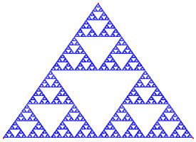
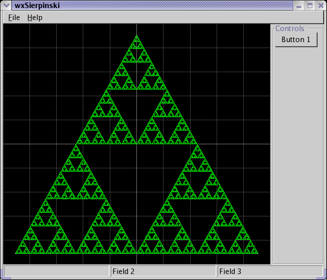

# sierpinski

Welcome to the new Sierpinski's triangle page. This project is intended to be a
random collection of programs/applets that generate Sierpinsk's triangle, mat,
and similar variations. It's not meant to be a general talk about fractals,
however.

Some of this code is quite old and my not compile.  The DOS one still works if
you have an emulator!

## DOS

Here was an attempt to make the smallest x86 assembly version of a Sierpinski's
Triangle generator. Some interesting notes:

* It's only 154 bytes!
* I use the random method of choosing vertices. However, I manage to avoid
  using a random number generator by simply reading from program memory
* The code isn't super-optimized. I was still intending it to be a bit readable
* This only works in 320x200 VGA mode.

To generate the appropriate .com file, do this:

```
    debug < s.asm
```

# Screenshots


### Java


### wxWindows


